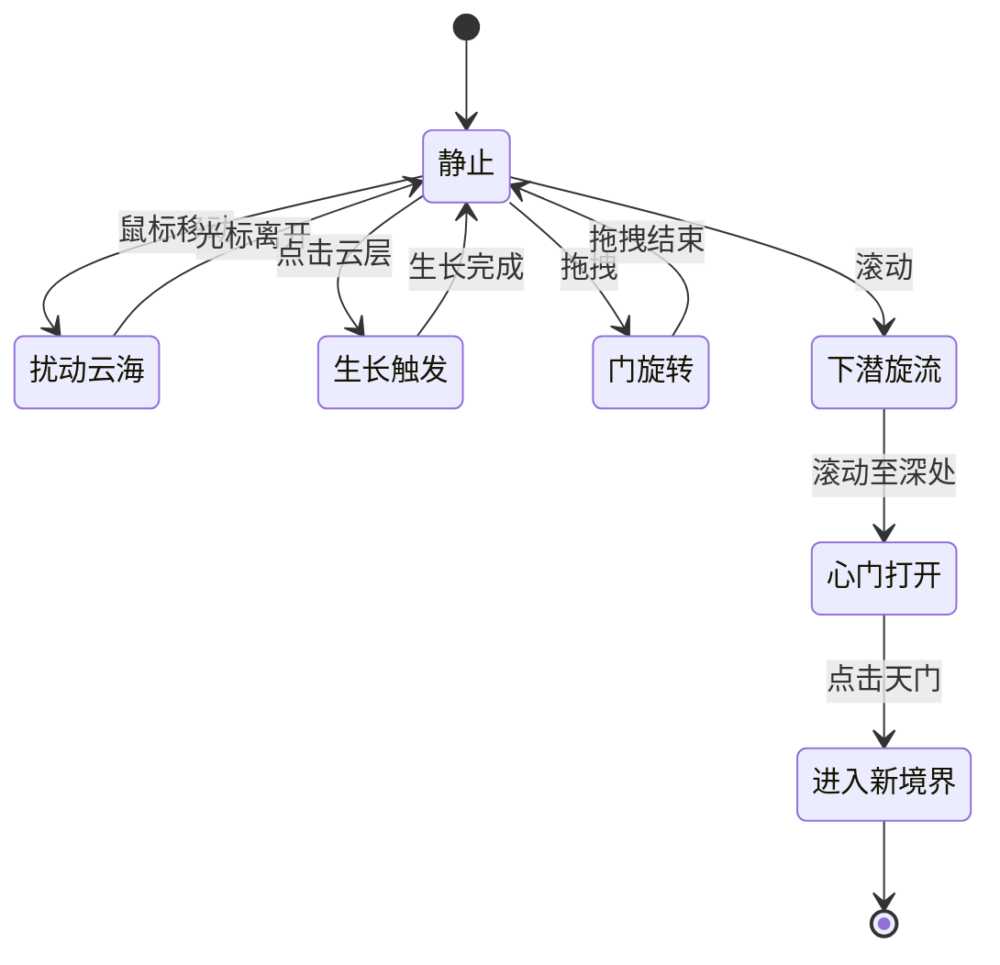

# ACT0 状态机（FSM）

## 状态图



## 状态定义

| 状态 | 描述 | 视觉表现 | 可触发事件 |
|---|---|---|---|
| **静止** | 初始状态，云海缓慢流动，门悬浮 | 云海 base animation（4-8s周期），门静止 | mouseMove, click, drag, scroll |
| **扰动云海** | 鼠标移动导致云层扰动 | 鼠标位置波纹，粒子偏移 | mouseMove(持续), mouseleave(→静止) |
| **生长触发** | 点击触发光→裂隙→苔藓生长 | 三步递进动画（0.3s+0.5s+1.5s） | 无（动画完成后→静止） |
| **门旋转** | 拖拽门体绕Y轴旋转 | 门跟随鼠标旋转，-45°~+45° | drag(持续), dragend(→静止) |
| **下潜旋流** | 滚动导致镜头下潜+金粉螺旋 | 镜头Z轴推进，云雾螺旋，金粉出现 | scroll(持续), scrollEnd(→静止/心门打开) |
| **心门打开** | 滚动至极限，门发出光芒 | 门体发光，金粉汇聚，天门显现 | click(→进入新境界) |
| **进入新境界** | 点击天门，场景切换 | 白光过渡，云层消散，新场景载入 | 无（终态） |

## 状态转换表

| 当前状态 | 事件 | 下一状态 | 条件 | 动作 |
|---|---|---|---|---|
| 静止 | mouseMove | 扰动云海 | 光标在云海区域 | 启动扰动动画 |
| 扰动云海 | mouseMove | 扰动云海 | 持续移动 | 更新扰动位置 |
| 扰动云海 | mouseleave | 静止 | 光标离开 | 扰动 ease-out 消散 |
| 静止 | click(云层) | 生长触发 | 点击在云海/地面区域 | 启动微光→裂隙→生长序列 |
| 生长触发 | animationEnd | 静止 | 生长动画完成 | 保持苔藓状态 |
| 静止 | click(门) | 进入新境界 | 点击在门区域(mask_door命中) | 镜头穿透+场景切换 |
| 静止 | mousedown(门)+mousemove | 门旋转 | 拖拽开始 | 门跟随旋转 |
| 门旋转 | mousemove | 门旋转 | 持续拖拽 | 更新旋转角度 |
| 门旋转 | mouseup | 静止 | 拖拽结束 | 门 spring 回弹到0° |
| 静止 | wheel | 下潜旋流 | 滚动开始 | 镜头下潜+金粉螺旋 |
| 下潜旋流 | wheel | 下潜旋流 | 持续滚动 | 更新下潜深度 |
| 下潜旋流 | wheelEnd(depth<max) | 静止 | 滚动停止，未到极限 | 镜头 ease-out 停止 |
| 下潜旋流 | wheelEnd(depth≥max) | 心门打开 | 滚动至极限深度 | 门发光，天门显现 |
| 心门打开 | click(天门) | 进入新境界 | 点击天门 | 白光过渡+场景切换 |

## FSM 实现（JavaScript）

```javascript
class ACT0StateMachine {
  constructor() {
    this.state = 'idle'; // 静止
    this.depth = 0;
    this.maxDepth = 100;
    this.growthActive = false;
  }

  transition(event, data = {}) {
    const transitions = {
      idle: {
        mouseMove: () => this.enter('cloudDisturb'),
        clickCloud: () => this.enter('growth'),
        clickDoor: () => this.enter('newRealm'),
        dragStart: () => this.enter('doorRotate'),
        scroll: () => this.enter('diveSwirl')
      },
      cloudDisturb: {
        mouseMove: () => this.updateDisturb(data),
        mouseLeave: () => this.enter('idle')
      },
      growth: {
        animationEnd: () => this.enter('idle')
      },
      doorRotate: {
        dragMove: () => this.updateRotation(data),
        dragEnd: () => this.enter('idle', { rebound: true })
      },
      diveSwirl: {
        scroll: () => this.updateDepth(data),
        scrollEnd: () => {
          if (this.depth >= this.maxDepth) this.enter('heartOpen');
          else this.enter('idle');
        }
      },
      heartOpen: {
        clickDoor: () => this.enter('newRealm')
      }
    };

    const handler = transitions[this.state]?.[event];
    if (handler) handler();
    else console.warn(`Invalid transition: ${this.state} + ${event}`);
  }

  enter(state, opts = {}) {
    this.exit(this.state);
    this.state = state;
    this.enterState(state, opts);
  }

  enterState(state, opts) {
    switch (state) {
      case 'idle':
        if (opts.rebound) this.reboundDoor();
        this.startBaseAnimation();
        break;
      case 'cloudDisturb':
        this.startCloudDisturb();
        break;
      case 'growth':
        this.startGrowthSequence();
        break;
      case 'doorRotate':
        this.startDoorDrag();
        break;
      case 'diveSwirl':
        this.startDive();
        break;
      case 'heartOpen':
        this.openHeartDoor();
        break;
      case 'newRealm':
        this.transitionToNewRealm();
        break;
    }
  }

  exit(state) {
    switch (state) {
      case 'cloudDisturb': this.stopCloudDisturb(); break;
      case 'diveSwirl': this.stopDive(); break;
    }
  }
}
```

## 状态持久化与恢复

- 页面刷新后恢复到 `静止` 状态
- 生长触发的苔藓状态可持久化（localStorage），刷新后保留
- 下潜深度不持久化，刷新后重置
- 移动端后台切换后恢复到 `静止`（避免状态混乱）

## 错误处理

- 无效状态转换：console.warn，不改变状态
- 动画中断：回到 `静止`，保留已完成的视觉效果（如苔藓）
- 资源加载失败：降级到无金粉/无体积雾的基础版本
