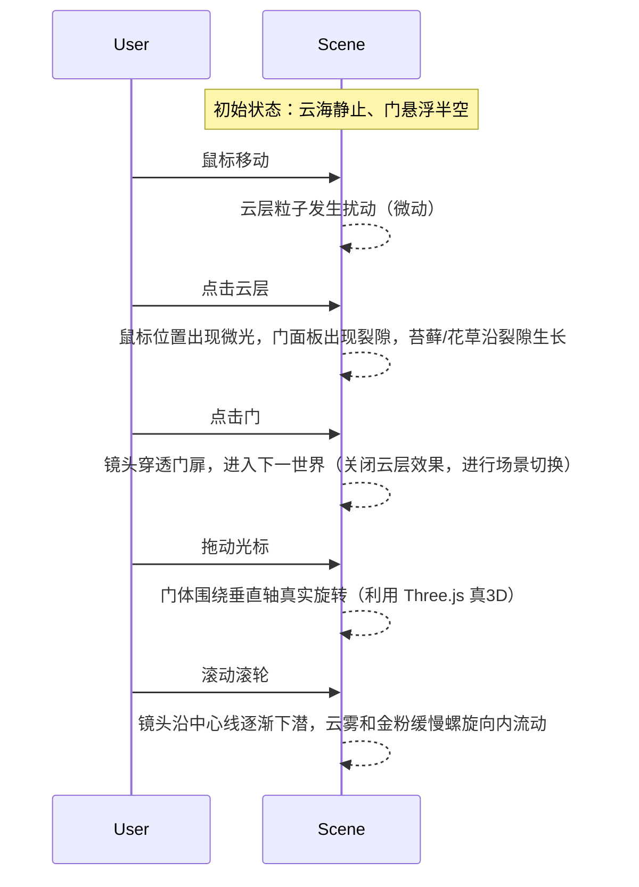

# ACT0 交互编排时间线

## 交互触发链

## 详细交互参数

### 1. 鼠标移动 → 扰动云海

| 参数 | 值 | 说明 |
|---|---|---|
| 触发 | mousemove（非点击） | 光标在云海区域移动 |
| 效果 | 云层粒子扰动 | 鼠标位置产生波纹/流动 |
| 扰动半径 | 100-200px | 以光标为中心 |
| 扰动强度 | 0.1-0.3 | 轻微，不破坏整体 |
| 持续时间 | 500-1000ms | ease-out 自然消散 |
| 缓动 | ease-out | 扰动逐渐消失 |
| 意象 | 风起云涌 | 观者的存在影响了空间 |

### 2. 点击云层 → 微光+裂隙+苔藓生长

| 参数 | 值 | 说明 |
|---|---|---|
| 触发 | click（在云海/地面区域） | 非门区域 |
| 效果序列 | 微光→裂隙→生长 | 三步递进 |
| 微光 | 300ms | 点击位置出现柔和光点 |
| 裂隙 | 500ms | 地面/门面板出现裂纹，从点击点向外扩展 |
| 生长 | 1000-2000ms | 苔藓/花草沿裂隙向上生长 |
| 缓动 | ease-out | 生长自然减速 |
| 意象 | 物我同生 | 触碰唤醒了沉睡的生命 |

### 3. 点击门 → 镜头穿透

| 参数 | 值 | 说明 |
|---|---|---|
| 触发 | click（在门体区域，命中 mask_door） | 门的遮罩检测 |
| 效果 | 镜头向门推进并穿过 | 进入下一世界 |
| 推进持续 | 1500-2000ms | ease-in-out |
| 过渡效果 | 白光/模糊 | 穿过瞬间的视觉过渡 |
| 场景切换 | 关闭云层效果 | 门后是新场景 |
| 意象 | 界的跨越 | 从已知进入未知 |

### 4. 拖拽 → 门体旋转

| 参数 | 值 | 说明 |
|---|---|---|
| 触发 | mousedown + mousemove（在门区域） | 拖拽门体 |
| 效果 | 门绕垂直轴（Y轴）真实旋转 | Three.js 真3D |
| 旋转范围 | -45° ~ +45° | 不超过半开 |
| 旋转映射 | 拖拽X位移 × 0.5°/px | 跟手但不过敏 |
| 拖拽结束 | 回弹到 0° | spring 缓动，500ms |
| 缓动 | 拖拽时 linear（跟手），回弹 spring | - |
| 意象 | 门的开合 | 观者主动探索 |

### 5. 滚动滚轮 → 下潜旋流

| 参数 | 值 | 说明 |
|---|---|---|
| 触发 | wheel（滚动） | 鼠标滚轮或触摸滑动 |
| 效果 | 镜头沿中心线下潜 + 云雾金粉螺旋 | 深入核心 |
| 下潜速度 | 滚动速度 × 0.5 | 跟随滚动 |
| 螺旋效果 | 云雾和金粉沿镜头方向螺旋向内 | 半径逐渐缩小 |
| 递进 | 浅潜(云雾扰动) → 深潜(金粉螺旋) → 极限(心门打开) | 三阶段 |
| 停止 | ease-out 减速 | 滚动停止后 |
| 意象 | 深入 | 从表面进入核心 |

## 移动端适配

| 桌面交互 | 移动端替代 | 说明 |
|---|---|---|
| 鼠标移动 | 触摸移动（touchmove） | 手指在屏幕上移动扰动云海 |
| 点击 | 触摸（touchstart+touchend < 300ms） | 点击触发生长 |
| 拖拽 | 触摸滑动（touchmove on door） | 滑动旋转门 |
| 滚轮 | 上下滑动（swipe up/down） | 滑动下潜 |
| 悬停 | 长按（touchstart > 500ms） | 长按触发预览效果 |

## 性能要求

| 指标 | 阈值 | 说明 |
|---|---|---|
| 帧率 | ≥ 30fps（桌面），≥ 24fps（移动） | 交互流畅 |
| 响应延迟 | ≤ 100ms | 交互触发到视觉反馈 |
| 粒子数量 | 云雾 ≤ 5000，金粉 ≤ 500 | 性能预算 |
| 着色器复杂度 | ≤ 中等（无光线追踪） | WebGL 兼容 |
| 降级方案 | 低端设备关闭金粉+体积雾 | 保留核心交互 |
