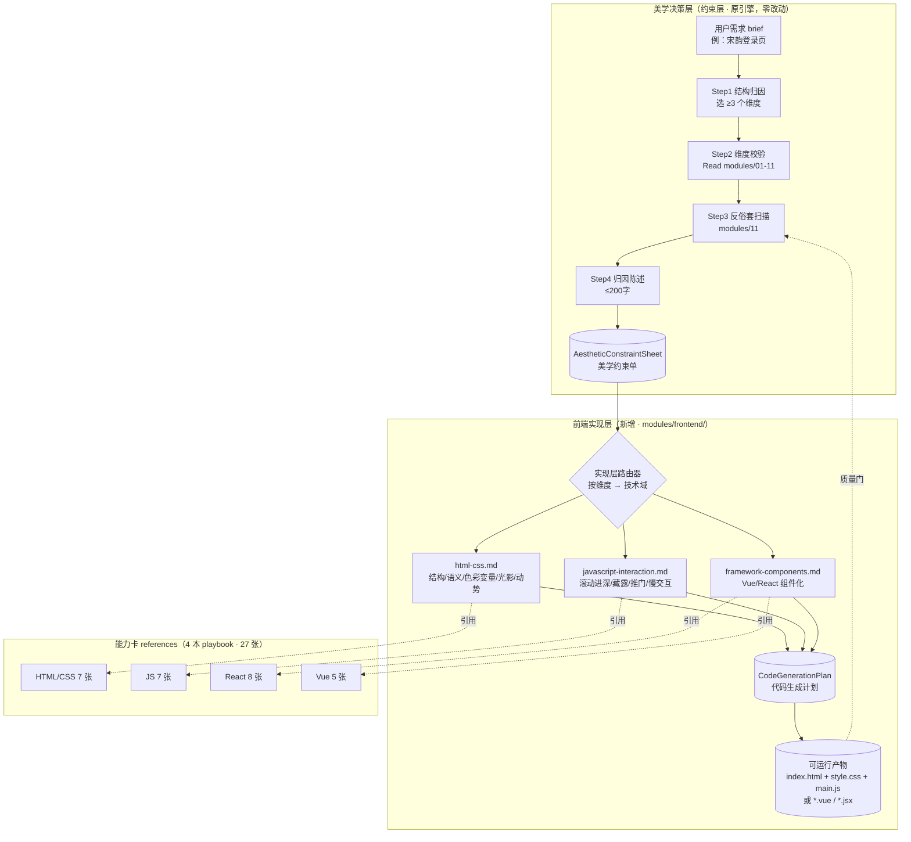
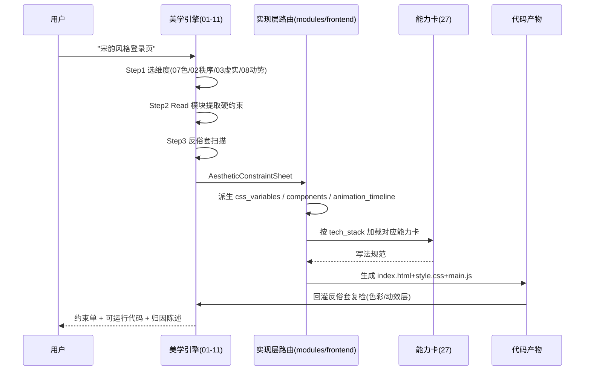

# 融合架构设计文档
## Eastern Aesthetic Decision Engine × Frontend Capability Playbook —— 从美学决策到代码生成的闭环架构

> 版本：v1.0 ｜ 状态：可交付集成 ｜ 约束：原 11 个美学模块零改动，新增内容只落在 `modules/frontend/` 与 SKILL.md 实现层章节。

---

## 0. 本文档解决什么

原引擎回答「这个设计**为什么**是中国的」，输出的是**约束**（硬约束/软建议/色彩比例/动势规范）。但约束不会自己变成页面。本架构在引擎下方加一层**实现层路由**，把每一份 `AestheticConstraintSheet` 确定性地翻译成一份 `CodeGenerationPlan`，再路由到 4 本前端 playbook 的能力卡，最终产出可运行 HTML/CSS/JS（或 Vue/React 组件）。

闭环断言：**给定任何一句设计需求（如"宋韵风格登录页"），系统应同时输出 (a) 11 维度美学约束单 + (b) 可运行前端代码，且代码能通过反俗套扫描。**

---

## 1. 双层总览架构图



**关键设计**：美学层与实现层之间只通过两个结构化数据对象通信（`AestheticConstraintSheet` ⇄ `CodeGenerationPlan`），二者解耦——美学模块不知道 CSS，实现模块不重新发明色彩规则。代码产物回灌给 `modules/11` 做反俗套复检，形成回路。

---

## 2. 设计原则

1. **约束先行，代码在后**：不先写页面再贴中式元素。先生成约束单，再由约束单驱动代码。
2. **一个维度至少落到一个可测量的 CSS/JS 参数**：禁止"感觉很禅"这种无法编码的指令。
3. **能力卡是 references，不是复制源**：实现层模块只引用能力卡的路径与意图，不在本 Skill 内重抄卡片内容。
4. **原有 11 模块只读**：本架构不修改、不重写 `modules/01..11`。所有增强是新增。
5. **反俗套是代码质量门**：代码生成后必须跑一遍 `11-anti-cliche.md` 的动效层/色彩层清单，命中即回炉。

---

## 3. 核心数据结构

### 3.1 `AestheticConstraintSheet`（美学约束单 · 美学层输出）

这是原引擎 §3 提到的 ACT Constraint Sheet 的**可编码完整版**。字段全部可被实现层直接消费。

```yaml
# ===== 身份 =====
sheet_id: "act0-song-login"
design_brief: "宋韵风格登录页"
mood: "song-elegant"            # song-elegant / chan-zen / tang-tang / night-feast / misty-blue
attribution_statement: "本设计东方性建立在中轴递进的空间秩序、七藏三露的虚实关系、方五斜七的模数克制与天光明暗比3:7之上；不靠红墙飞檐，而靠月白留白与古金细线使观者在呼吸感中体验宋韵。"

# ===== 结构维度（≥3，带权重）=====
structural_dimensions:
  - {id: "07-color",      weight: primary, hard: "全图 S≤50%；正红#FF0000/亮金#FFD700 禁用", soft: "阴影须带环境色"}
  - {id: "02-spatial-order", weight: primary, hard: "核心元素居中轴；间距为 8px 模数倍数", soft: "3 开间网格"}
  - {id: "03-void-solid", weight: secondary, hard: "表单周围留白≥35%", soft: "七藏三露"}
  - {id: "08-motion",     weight: secondary, hard: "禁 bounce/spin/linear；入场=被遮挡后浮现", soft: "云 6s 呼吸循环"}

# ===== 色彩系统（精确到 HSL，见 §3.3）=====
color_system:
  palette:
    - {role: primary,   name: 月白, hex: "#E8E4D9", hsl: "hsl(44,25%,88%)", area_pct: 65, usage: 页面底/留白}
    - {role: secondary, name: 黛青, hex: "#2C3E50", hsl: "hsl(210,28%,24%)", area_pct: 25, usage: 文字/远山/主结构}
    - {role: accent,    name: 古金, hex: "#B8860B", hsl: "hsl(43,89%,38%)", area_pct: 6,  usage: 按钮描边/匾额线}
    - {role: shadow,    name: 黛影, hex: "#1A2332", hsl: "hsl(222,30%,15%)", area_pct: 4,  usage: 阴影/底部暗部}
  saturation_max: 50            # HSL S 上限
  hard_fail_hex: ["#FF0000", "#FFD700", "#00FFFF", "#000000"]

# ===== 比例与模数 =====
proportion:
  base_module_m: "8px"
  spacing_scale: ["1m","2m","3m","4m","6m","8m"]   # 禁 5m/7m
  type_scale: ["0.75m","1m","1.5m","2m","3m"]
  void_solid_ratio: "7:5"       # 虚:实
  focal_points_max: 1

# ===== 空间秩序 =====
spatial:
  axis: offset                  # strict | offset | hidden
  bays: 3
  hierarchy_levels_min: 3
  depth_transitions_min: 1

# ===== 光影 =====
lighting:
  primary_source: skylight      # skylight|leaked|side|bounced|moonlight
  time_setting: morning          # dawn|noon|dusk|night|cloudy
  light_dark_ratio: "3:7"
  has_leak_shadow: true

# ===== 动势（可复用参数，见 §4.6）=====
motion:
  prototypes: ["cloud","light"]
  duration_ms: [2000, 8000]
  easing:
    cloud: "cubic-bezier(0.25,0.1,0.25,1)"
    breath: "cubic-bezier(0.45,0.05,0.55,0.95)"
  parallax_layers_min: 3
  entry_mode: emerge            # emerge | pop(禁)
  breathing_loop: true
  hard_fail: ["bounce","back","spin","scale-overshoot","particle","linear"]

# ===== 反俗套 =====
anti_cliche:
  scanned: true
  hard_fail_hits: []
  forbidden: ["祥云纹满铺","毛笔字当标题","正红宫墙","灯笼","飞檐特写","弹跳入场","纯黑阴影"]
```

### 3.2 `CodeGenerationPlan`（代码生成计划 · 实现层输出）

```yaml
plan_id: "plan-act0-song-login"
from_sheet: "act0-song-login"

tech_stack:
  markup: html5                  # html5 | jsx | vue-template
  style: css-variables          # css-variables | inline
  logic: vanilla-js             # vanilla-js | react-class | vue-options
  framework: none               # none | react | vue
  entry: "index.html"

# 组件清单：每个组件声明它消费哪些美学维度
components:
  - {name: CloudBackdrop, el: ".scene__cloud", dims: ["08-motion","06-light"], behavior: "云 6s ease-cloud 循环"}
  - {name: Gate,          el: ".gate",         dims: ["01-philosophy","09-architecture","03-void-solid"], behavior: "远景藏→滚动趋近→过门"}
  - {name: LoginForm,     el: "form.login",    dims: ["02-spatial-order","07-color"], behavior: "中轴 3 开间，月白底黛字古金描边按钮"}

# 由 color_system / proportion / motion 派生的 CSS 变量
css_variables:
  ":root":
    --c-primary:   "#E8E4D9"
    --c-secondary: "#2C3E50"
    --c-accent:    "#B8860B"
    --c-shadow:    "#1A2332"
    --m:           "8px"
    --ease-cloud:  "cubic-bezier(0.25,0.1,0.25,1)"
    --ease-breath: "cubic-bezier(0.45,0.05,0.55,0.95)"

# 动画时序
animation_timeline:
  - {trigger: load,        target: ".scene__cloud", duration_ms: 6000, easing: "var(--ease-cloud)", iterate: infinite}
  - {trigger: scroll-20%,  target: ".gate",         duration_ms: 2500, action: emerge}
  - {trigger: hover,        target: ".login__btn",  duration_ms: 600,  action: "门微启/光微漏"}

# 本计划引用的能力卡（按技术域，全量见 §6）
referenced_cards:
  markup: ["html-doc-skeleton","html-semantic-tagging","html-nesting-rules","img-alt-seo","image-format-selection","asset-path-resolution","webp-progressive-enhancement"]
  logic:  ["data-driven-render","branch-switch","data-types-typeof","equality-logic","type-conversion","let-const-naming","debug-errors"]
  framework: []                  # none 时为空；react/vue 时填对应 8/5 张

# 质量门（代码产物必须逐条通过）
quality_gates:
  - "所有颜色 S≤50%"
  - "无 #FF0000/#FFD700/#000000"
  - "无 bounce/back/spin/linear easing"
  - "间距全部为 8px 模数倍数"
  - "留白≥35%"
  - "≥1 个极缓呼吸循环"
  - "通过 modules/11 四类俗套扫描"
```

### 3.3 精确色彩系统表（HSL/RGB/比例）

| 色名 | HEX | RGB | HSL | 角色 | 面积比 | 用途 |
|---|---|---|---|---|---|---|
| 月白 | `#E8E4D9` | rgb(232,228,217) | `hsl(44,25%,88%)` | 主色 | 60–70% | 页面底、留白、水面 |
| 缟素 | `#F0EDE5` | rgb(240,237,229) | `hsl(44,27%,92%)` | 主色浅阶 | — | 卡片/输入框底 |
| 黛青 | `#2C3E50` | rgb(44,62,80) | `hsl(210,28%,24%)` | 辅色 | 20–30% | 正文、远山、主结构 |
| 玄青 | `#1A1A2E` | rgb(26,26,46) | `hsl(240,28%,14%)` | 暗部 | 5–10% | 夜空、阴影（非纯黑） |
| 青(青绿) | `#4A6B5C` | rgb(74,107,92) | `hsl(153,18%,35%)` | 辅色(青绿系) | ≤15% | 山水、竹 |
| 青灰 | `#6B7B8C` | rgb(107,123,140) | `hsl(211,13%,48%)` | 过渡 | — | 雾天天空 |
| 烟紫 | `#6E5D7C` | rgb(110,93,124) | `hsl(273,14%,43%)` | 过渡 | ≤10% | 暮色、云影 |
| 古金(暗) | `#B8860B` | rgb(184,134,11) | `hsl(43,89%,38%)` | 点缀 | ≤8% | 匾额线、按钮描边、点睛 |
| 赭黄(哑) | `#C4A35A` | rgb(196,163,90) | `hsl(41,47%,56%)` | 点缀浅阶 | ≤8% | 人物、灯火 |
| 朱砂(暗) | `#8B2500` | rgb(139,37,0) | `hsl(16,100%,27%)` | 点缀 | ≤5% | 印章/重点（面积极小，容忍高饱和） |
| 朱砂(沉) | `#A52A2A` | rgb(165,42,42) | `hsl(0,59%,41%)` | 点缀(大面积朱砂替代) | ≤10% | 当朱砂需>5%时用此降饱和版 |
| UI朱砂(降饱和) | — | — | `hsl(16,45%,35%)` | 按钮主色(安全) | ≤15% | 登录按钮等需大面积时用此，禁正红 |

> **铁律**：`saturation_max: 50`。凡大面积(>10%)使用朱砂，必须降到 `hsl(16,45%,35%)` 这一档，禁止 `#FF0000`。古金必须哑光，禁止 `#FFD700`。

---

## 4. 美学维度 → 前端技术映射（每条带可运行代码）

> 以下代码片段可直接粘贴进 `<style>`。所有尺寸均为 `--m:8px` 的倍数。

### 4.1 空间秩序（02）→ Grid 中轴 + 开间模数

中轴=核心列居中；开间=`grid-template-columns` 用 3 列，明间(中)宽于次间，对应模块 02 的「明间 1.2x > 次间 1.0x」。

```css
:root { --m: 8px; }
.hall {
  display: grid;
  /* 三开间：明间(中) 1.2fr，次间 1fr */
  grid-template-columns: 1fr 1.2fr 1fr;
  grid-template-rows: auto;
  column-gap: calc(3 * var(--m));   /* 24px = 3m */
  max-width: calc(60 * var(--m));   /* 480px，方五斜七画幅 */
  margin-inline: auto;              /* 中轴：整体居中 */
}
.hall__core { grid-column: 2; }      /* 核心元素落明间 */
```

### 4.2 虚实（03）→ 留白 / 藏 / 透

```css
/* 空：表单周围 ≥35% 留白 */
.login {
  padding: calc(8 * var(--m)) calc(6 * var(--m));  /* 64px / 48px */
  background: var(--c-primary);
}
/* 藏：核心元素默认被雾遮挡 1/3，滚动后浮现 */
.gate { opacity: 0; transform: translateY(calc(2 * var(--m))); transition: opacity 2.5s var(--ease-breath), transform 2.5s var(--ease-breath); }
.gate.is-revealed { opacity: 1; transform: none; }
/* 透：隔扇半透，光可穿 */
.screen { background: linear-gradient(180deg, rgba(232,228,217,.6), rgba(232,228,217,.25)); backdrop-filter: blur(2px); }
```

### 4.3 比例（04）→ CSS 变量模数 + √2 画幅

```css
:root {
  --m: 8px;
  /* √2 系列字号 */
  --fs-xs: calc(0.75 * var(--m));   /* 6px? 实际用 rem：见下 */
  --fs-1: calc(1 * var(--m));
}
/* 用 rem 更稳：m=8px → 字号梯度 */
.scene { aspect-ratio: 5 / 7; }     /* 方五斜七：竖幅，避免 16:9 西方感 */
```

### 4.4 色彩（07）→ `:root` 变量直出

```css
:root {
  --c-primary:   #E8E4D9;   /* 月白 65% */
  --c-secondary: #2C3E50;   /* 黛青 25% */
  --c-accent:    #B8860B;   /* 古金 6% */
  --c-shadow:    #1A2332;   /* 黛影 4% */
  --c-btn:       hsl(16,45%,35%);  /* UI朱砂，按钮主色 */
}
body { background: var(--c-primary); color: var(--c-secondary); }
.login__btn {
  background: var(--c-btn); color: var(--c-primary);
  border: 1px solid var(--c-accent);   /* 古金描边，面积极小 */
}
```

### 4.5 光影（06）→ 天光渐变 + 漏光投影（阴影带环境色，非纯黑）

```css
.scene {
  /* 天光：上方偏暖白 → 下方偏冷黛，明暗比 3:7 */
  background: linear-gradient(180deg,
    hsl(44,27%,92%) 0%,
    hsl(211,13%,60%) 45%,
    hsl(222,30%,15%) 100%);
}
/* 漏光：漏窗在地面投下格影 */
.floor::after {
  content: ""; position: absolute; inset: 0;
  background: repeating-linear-gradient(90deg,
    rgba(26,35,50,.18) 0 2px, transparent 2px 24px);
  mix-blend-mode: multiply;
}
/* 阴影不是纯黑，是黛影 */
.gate { box-shadow: 0 calc(3*var(--m)) calc(6*var(--m)) var(--c-shadow); }
```

### 4.6 动势（08）→ 云/水/烟/风/光 可复用 @keyframes（参数可调）

```css
:root {
  --ease-cloud:  cubic-bezier(0.25,0.1,0.25,1);
  --ease-water:   cubic-bezier(0.33,1,0.68,1);
  --ease-smoke:  cubic-bezier(0.17,0.67,0.12,0.99);
  --ease-breath: cubic-bezier(0.45,0.05,0.55,0.95);
}
/* 云：缓慢横移+体积漂移，4–8s 可调 */
@keyframes drift-cloud {
  from { transform: translate3d(-4%,0,0); }
  to   { transform: translate3d(4%,0,0); }
}
.scene__cloud {
  animation: drift-cloud 7s var(--ease-cloud) infinite alternate;
  /* 可调：duration 改 4000–8000ms；位移幅度改 % */
}
/* 水：正弦波纹 */
@keyframes wave {
  0%   { transform: translateX(0) translateY(0); }
  50%  { transform: translateX(-12px) translateY(2px); }
  100% { transform: translateX(-24px) translateY(0); }
}
.water { animation: wave 4s var(--ease-water) infinite linear; }
/* 烟：上升+扩散+透明 */
@keyframes rise-smoke {
  0%   { transform: translateY(0) scale(1);    opacity: .5; }
  100% { transform: translateY(-40px) scale(1.6); opacity: 0; }
}
.smoke { animation: rise-smoke 5s var(--ease-smoke) infinite; }
/* 光：极缓缓亮（云遮日） */
@keyframes breathe-light {
  0%,100% { opacity: .85; }
  50%     { opacity: 1; }
}
.scene { animation: breathe-light 10s var(--ease-breath) infinite; }
/* 禁：bounce / back / spin / linear 一律不得出现 */
```

### 4.7 建筑精神（09）→ 三段式结构组件

```css
/* 屋顶45% / 屋身35% / 台基20%，比例不可颠倒 */
.gate { display: grid; grid-template-rows: 45fr 35fr 20fr; }
.gate__roof { border-radius: 50% 50% 0 0 / 100% 100% 0 0; } /* 举折曲线 */
.gate__body { background: var(--c-secondary); }
.gate__base { background: hsl(44,25%,80%); }  /* 青石台基 */
```

### 4.8 交互（10）→ 滚动进深（视差≥3层）+ 推门

```js
// 滚动 = 进深：远/中/近三层视差，速度 0.2 / 0.5 / 1.0
const layers = [
  {el: document.querySelector('.layer-far'),   speed: 0.2},
  {el: document.querySelector('.layer-mid'),   speed: 0.5},
  {el: document.querySelector('.layer-near'), speed: 1.0},
];
addEventListener('scroll', () => {
  const y = scrollY;
  layers.forEach(l => l.el.style.transform = `translateY(${y * l.speed * -1}px)`);
}, {passive: true});

// 推门：点击=移开遮挡，≥0.6s
document.querySelector('.login__btn').addEventListener('click', (e) => {
  e.currentTarget.classList.add('is-open');   // CSS transition 0.6s 门微启
});
```

### 4.9 哲学(01)/反俗套(11) → 语义分层 + 自动检查

```html
<!-- 界=语义分区：header(外院) / main(核心) / footer(内界) -->
<header class="outer-court"></header>
<main class="inner-hall"><form class="login"></form></main>
```
代码生成后自动 grep：`#FF0000|#FFD700|cubic-bezier.*back|bounce|spin` 命中即回炉。

---

## 5. 模块组织方案（新增 `modules/frontend/`，原 11 模块不动）

```
modules/
├── 01-philosophy.md … 11-anti-cliche.md     （原样，只读）
└── frontend/                                 （新增）
    ├── html-css.md                           # 结构/语义/色彩变量/光影/动势落点
    ├── javascript-interaction.md             # 滚动进深/藏露/推门/慢交互
    ├── framework-components.md               # Vue/React 组件化路由
    └── components/                           # 可运行东方组件库（复制即跑）
        ├── gate.html                         # 门（三段式+进退场）
        ├── leaky-window.html                 # 漏窗（漏光投影）
        ├── screen.html                       # 屏风（软界半透）
        ├── scroll.html                       # 卷轴（藏露展开）
        └── plaque.html                       # 匾额（界标标题）
```

### 5.1 `modules/frontend/html-css.md` 职责
- 输入：约束单中的 `color_system / proportion / spatial / lighting / motion`
- 输出：`:root` CSS 变量块 + 布局/光影/动势 CSS
- 引用能力卡：HTML/CSS 7 张（见 §6）
- 关键纪律：所有色值来自 §3.3，禁止即兴取色；所有间距是 `--m` 倍数。

### 5.2 `modules/frontend/javascript-interaction.md` 职责
- 输入：`motion.entry_mode / lighting.time_setting / interaction`
- 输出：视差滚动、IntersectionObserver 藏露、推门状态机、主题(晨/昏/夜)切换
- 引用能力卡：JS 7 张（data-driven-render 渲染列表、branch-switch 分支、debug-errors 排障…）

### 5.3 `modules/frontend/framework-components.md` 职责
- 输入：`tech_stack.framework`
- 决策：`none`→纯静态；`react`→React 8 张卡；`vue`→Vue 5 张卡
- 把 `components/` 里的 HTML 组件改写为 `.jsx` / `.vue` 组件。

### 5.4 可运行东方组件库（复制即跑）

以下为**完整单文件**，保存为 `.html` 直接浏览器打开即可运行。

#### 组件：门 `gate.html`（三段式 + 云底 + 滚动浮现）

```html
<!doctype html>
<html lang="zh-CN"><head><meta charset="utf-8">
<style>
:root{--m:8px;--c-primary:#E8E4D9;--c-secondary:#2C3E50;--c-accent:#B8860B;--c-shadow:#1A2332;--ease-breath:cubic-bezier(.45,.05,.55,.95)}
*{box-sizing:border-box;margin:0}
body{background:var(--c-primary);font-family:serif;color:var(--c-secondary)}
.scene{position:relative;height:100vh;display:grid;place-items:center;overflow:hidden;
  background:linear-gradient(180deg,hsl(44,27%,92%),hsl(211,13%,60%) 45%,hsl(222,30%,15%))}
.cloud{position:absolute;width:60%;height:60px;background:rgba(232,228,217,.5);filter:blur(18px);border-radius:40px;animation:drift 8s var(--ease-breath) infinite alternate}
@keyframes drift{from{transform:translateX(-6%)}to{transform:translateX(6%)}}
.gate{display:grid;grid-template-rows:45fr 35fr 20fr;width:calc(20*var(--m));opacity:0;transform:translateY(calc(2*var(--m)));transition:opacity 2.5s var(--ease-breath),transform 2.5s var(--ease-breath)}
.gate.show{opacity:1;transform:none}
.gate__roof{height:calc(9*var(--m));background:var(--c-secondary);border-radius:50% 50% 0 0/100% 100% 0 0}
.gate__body{background:var(--c-secondary);border-inline:calc(1*var(--m)) solid var(--c-accent)}
.gate__base{height:calc(4*var(--m));background:hsl(44,25%,80%)}
.hint{position:absolute;bottom:calc(3*var(--m));font-size:calc(1*var(--m));letter-spacing:.2em;opacity:.7}
</style></head>
<body><main class="scene"><div class="cloud"></div><div class="gate" id="gate">
  <div class="gate__roof"></div><div class="gate__body"></div><div class="gate__base"></div>
</div><p class="hint">向下滚动 · 趋近门</p></main>
<script>addEventListener('scroll',()=>{if(scrollY>40)gate.classList.add('show')},{passive:true});addEventListener('load',()=>{if(scrollY>40)gate.classList.add('show')});</script>
</body></html>
```

#### 组件：漏窗 `leaky-window.html`（漏光投影）

```html
<!doctype html><html lang="zh-CN"><head><meta charset="utf-8"><style>
body{margin:0;min-height:100vh;display:grid;place-items:center;background:hsl(222,30%,15%)}
.win{position:relative;width:220px;height:300px;background:hsl(44,27%,92%);overflow:hidden;
  box-shadow:0 24px 48px rgba(26,35,50,.6)}
/* 漏光：窗格投影 */
.win::after{content:"";position:absolute;inset:0;
  background:repeating-linear-gradient(90deg,rgba(26,35,50,.25) 0 3px,transparent 3px 26px),
             repeating-linear-gradient(0deg,rgba(26,35,50,.25) 0 3px,transparent 3px 40px)}
.glow{position:absolute;inset:0;background:radial-gradient(circle at 50% 30%,hsl(44,80%,90%),transparent 60%);animation:breathe 10s ease-in-out infinite}
@keyframes breathe{0%,100%{opacity:.8}50%{opacity:1}}
</style></head><body><div class="win"><div class="glow"></div></div></body></html>
```

#### 组件：屏风 `screen.html`（软界半透 + 悬停揭示）

```html
<!doctype html><html lang="zh-CN"><head><meta charset="utf-8"><style>
body{margin:0;min-height:100vh;display:grid;place-items:center;background:linear-gradient(180deg,#E8E4D9,#6B7B8C)}
.screen{position:relative;width:260px;height:340px;cursor:pointer;
  background:linear-gradient(180deg,rgba(232,228,217,.65),rgba(232,228,217,.25));
  backdrop-filter:blur(2px);border-inline:2px solid #B8860B;transition:opacity .8s ease}
.screen .hidden{position:absolute;inset:20px;display:grid;place-items:center;color:#2C3E50;opacity:0;transition:opacity .8s ease}
.screen:hover{background:linear-gradient(180deg,rgba(232,228,217,.9),rgba(232,228,217,.6))}
.screen:hover .hidden{opacity:1}
</style></head><body><div class="screen"><div class="hidden">· 藏 ·</div></div></body></html>
```

> 卷轴 `scroll.html`（展开藏露）与匾额 `plaque.html`（界标）按同模式生成：卷轴用 `max-height` transition 实现展开；匾额用古金 `border-bottom` + 月白底，禁毛笔字。模板在 `framework-components.md` 中给出。

---

## 6. 前端能力卡引用矩阵（全量 27 张，无一遗漏）

> 任务称"22 张"为发布态子集；此处按 4 本 playbook 的 `capability-index` 全量引用，确保**一张不漏**。每张卡标注被哪个实现层模块消费。

| # | 能力卡 | 所属 | 用途（被谁引用） |
|---|---|---|---|
| 1 | html-doc-skeleton | HTML/CSS | html-css.md：index.html 骨架/charset/lang |
| 2 | html-semantic-tagging | HTML/CSS | html-css.md：界=header/main/footer 语义 |
| 3 | html-nesting-rules | HTML/CSS | html-css.md：块级/行内嵌套合法性 |
| 4 | img-alt-seo | HTML/CSS | html-css.md：背景山水图 alt/尺寸 |
| 5 | image-format-selection | HTML/CSS | html-css.md：云/山图存 WebP/PNG |
| 6 | asset-path-resolution | HTML/CSS | html-css.md：相对路径 `./` `../` |
| 7 | webp-progressive-enhancement | HTML/CSS | html-css.md：WebP 双图降级 |
| 8 | type-conversion | JS | javascript-interaction.md：滚动 px/数值 |
| 9 | data-types-typeof | JS | javascript-interaction.md：状态类型 |
| 10 | data-driven-render | JS | javascript-interaction.md：进深列表/组件渲染 |
| 11 | branch-switch | JS | javascript-interaction.md：晨/昏/夜主题分支 |
| 12 | debug-errors | JS | 全层：控制台报错排障 |
| 13 | equality-logic | JS | javascript-interaction.md：滚动阈值判断 |
| 14 | let-const-naming | JS | javascript-interaction.md：变量声明规范 |
| 15 | react-jsx-rules | React | framework-components.md：JSX className/inline style |
| 16 | react-event-this-binding | React | framework-components.md：推门事件回调 this |
| 17 | react-state-setstate | React | framework-components.md：进入步骤 step 状态 |
| 18 | react-props-passing | React | framework-components.md：palette 传入组件 |
| 19 | react-refs-dom-access | React | framework-components.md：视差 transform 操作 DOM |
| 20 | react-props-validation | React | framework-components.md：palette 必填校验 |
| 21 | react-setup-three-libs | React | framework-components.md：CDN 三库跑起 |
| 22 | react-component-definition | React | framework-components.md：Gate/Screen 组件定义 |
| 23 | instance-binding | Vue | framework-components.md：new Vue / v-bind / v-model |
| 24 | event-modifiers | Vue | framework-components.md：@click.stop 推门 |
| 25 | computed-watch | Vue | framework-components.md：scroll depth computed / 主题 watch |
| 26 | vfor-key-diff | Vue | framework-components.md：进深步骤列表渲染 |
| 27 | style-conditional | Vue | framework-components.md：:class 控制藏/揭示 |

**引用方式**：实现层模块以路径 + 意图形式引用，不复制正文。例：
```
references:
  - path: html-css-zhangtianyu-router/references/capabilities/html-semantic-tagging.md
    intent: "按内容含义选标签，界=header/main/footer"
```

---

## 7. 端到端调用流程



---

## 8. 三个闭环验证场景

| 场景 | mood | 结构维度 | 主色方案 | 动势原型 | 产物 |
|---|---|---|---|---|---|
| 宋韵登录页 | song-elegant | 07色+02秩序+03虚实+08动势 | 月白65/黛青25/古金6 | cloud+breath | gate.html + 表单 |
| 禅意作品集 | chan-zen | 01哲学+03虚实+04比例+06光影 | 缟素70/黛20/赭黄5 | water+light | screen.html + 滚动进深 |
| 唐韵电商首页 | tang-tang | 09建筑+07色+10交互 | 黛50/沉朱砂35/古金10 | smoke+wind | 三段式 header + 推门菜单 |

### 8.1 宋韵登录页（已在 §3.1/§3.2/§4 给出完整约束单与代码）
- 约束单 → `act0-song-login`；代码 → `gate.html` + 古金描边按钮。
- 通过门：S≤50%（月白 S25%）、无正红、按钮用 `hsl(16,45%,35%)`、云 8s 缓动。

### 8.2 禅意作品集
- 约束单要点：`void_solid 7:5`、`focal_points_max 1`、`lighting=leaked`、`motion=water+light`。
- 代码：全屏 `screen.html` 软界，作品列表用 `data-driven-render` 渲染，滚动视差 3 层；点击作品=屏风半透揭示。

### 8.3 唐韵电商首页
- 约束单要点：`architecture.three-part 45/35/20`、朱砂用沉 `#A52A2A`(35%)、古金描边、`entry_mode=emerge`。
- 代码：三段式 header（屋顶=深色通栏 / 屋身=导航 / 台基=古金线），菜单点击=推门位移（`event-modifiers @click` 或 `event-this-binding`）。

---

## 9. 质量门与压力测试清单

代码产物交付前逐条自检（对应 `modules/11`）：

- [ ] 全图最大饱和度 ≤ 50%？
- [ ] 无 `#FF0000` / `#FFD700` / `#000000` / `#00FFFF`？
- [ ] 无 `bounce` / `back` / `spin` / `linear` / 粒子爆炸？
- [ ] 所有间距是 `--m:8px` 的整数倍？
- [ ] 留白 ≥ 35%、焦点 ≤ 1？
- [ ] 至少 1 个极缓(5–15s)呼吸循环？
- [ ] 阴影带环境色（黛影），非纯黑？
- [ ] 入场是"被遮挡→浮现"而非弹出？
- [ ] 归因陈述 ≤200 字且能说出 ≥3 个结构维度？
- [ ] 27 张能力卡中本计划引用的全部路径有效？

> **压力测试**：用本架构直接处理"宋韵登录页"，应能在一次输出中同时给出 §3.1 约束单 + §5.4 可运行 `gate.html`，并通过上述清单。缺任何一项即架构不合格。
