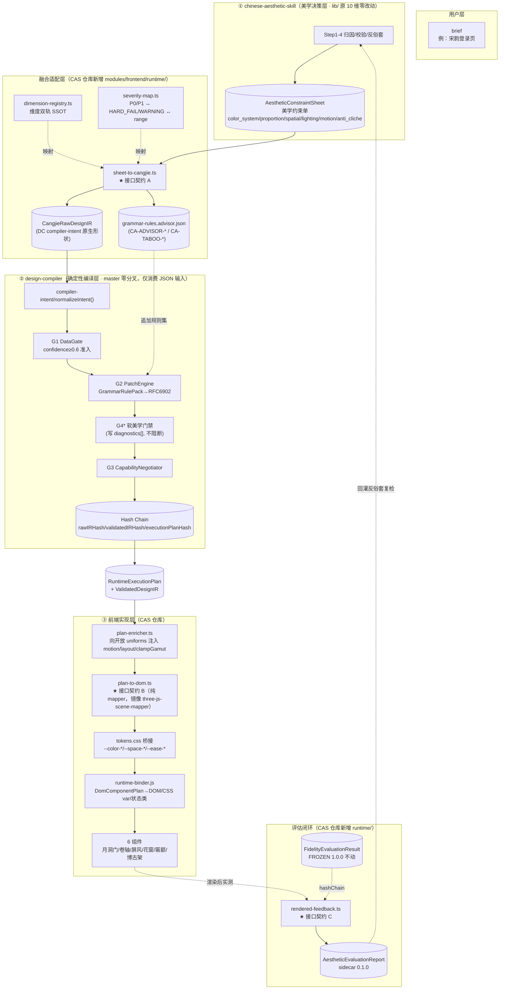

# 三产品融合架构设计

> 融合对象：
> ① **chinese-aesthetic-skill**（增强中式美学引擎，仓库 `eastern-aesthetic-decision-engine/`，分支 `feat/frontend-playbook-v2`，下称 **CAS**）
> ② **design-compiler**（确定性设计编译器，master `1.0.0-rc`，下称 **DC**）
> ③ **我们的前端实现层**（CAS 仓库内 `components/` + `modules/frontend/`，下称 **FE**）
>
> 版本：v1.0 ｜ 设计日期：2026-09-26 ｜ 设计原则：**DC 主流水线零分叉、FROZEN ABI 零破坏、CAS 原 10 维引擎 `lib/` 零改动、全部融合增量落在 CAS 仓库新增文件。**
>
> 输入依据：`docs/integration-analysis-dc.md`（DC 侧，已逐文件核对 `contracts.ts` / `compiler-intent/types.ts` / `estimated-parameter.schema.json` / `execution-plan.schema.json` / `config/grammar-rules.json` / `compiler-core/types.ts` / `compiler-core/three-js-scene-mapper.ts`）；CAS 侧 `docs/architecture.md`、`skill.yaml`、`modules/frontend/tokens.css`、`components/README.md`、`components/moon-gate.html`、`modules/frontend/mapping/F-proportion-color-system.md`。

---

## 0. 一句话结论

美学决策**不塞进 FROZEN ABI**，而是：让 CAS 的 `AestheticConstraintSheet` 在 **Cangjie 扁平层**编译成 DC 原生可哈希的 `CangjieEstimatedParameter[]`（主通道，接入点①）+ 持久 `GrammarRulePack` 规则（接入点②）；DC 产出的 `RuntimeExecutionPlan` 由 **FE 侧一个纯 mapper**（镜像 DC 自己的 `three-js-scene-mapper.ts`）经开放 `sceneBindings.*.uniforms/params` 缝隙喂给 6 个 HTML 组件；美学裁决以**独立 sidecar** 挂在 FROZEN 评估旁（接入点⑥），用 `testCaseId + hashChain` 因果链接。G4 美学门禁第一期只做**软门禁**（写 `diagnostics[]`），`BLOCKED_AESTHETIC` 硬阻断留给 ABI 2.0。

---

## 1. 融合架构图

### 1.1 三层全景（Mermaid）



### 1.2 端到端数据流（ASCII，标注每跳的输入输出物）

```
用户 "宋韵登录页"
  │
  ▼
[CAS 引擎]  ──产出──▶  AestheticConstraintSheet(YAML, architecture.md §3.1)
  │                        color_system{palette[],saturation_max,hard_fail_hex}
  │                        proportion{base_module,spacing_scale,void_solid_ratio}
  │                        spatial{axis,bays}  lighting{primary_source,light_dark_ratio}
  │                        motion{prototypes,easing,hard_fail}  structural_dimensions[≥3]
  ▼
[sheet-to-cangjie.ts]  ◀── dimension-registry / severity-map
  │  纯函数：sheet → CangjieRawDesignIR(compiler-intent/types.ts 形状)
  │  · color_system.palette[role]  → parameters[]{path:/color/{dominant,secondary,accent}, value:#hex}
  │  · proportion/spatial          → parameters[]{/composition/{negativeSpaceRatio,symmetry,depthLayerCount}}
  │  · lighting                    → parameters[]{/lighting/keyLight/{azimuth,elevation,colorTemp},/lighting/ambientRatio}
  │  · material                    → parameters[]{/materials/i/{roughness,metalness,wear,baseType}}
  │  · motion                      → 不进 Core IR（无 motion 节点）→ 改写 sceneBindings 扩展(见 plan-enricher)
  │  · violations P0              → range.fatalBelow + CangjieConstraint{type:threshold}
  │  · violations P1              → range.hard[min,max]
  │  · aestheticScore             → CangjieMetadata(open)，绝不写成参数 confidence
  │  · 7 条 requiredPaths 强制 confidence≥0.85, calibration.status=PRODUCTION
  ▼
CangjieRawDesignIR ──▶ DC normalizeIntent() ──▶ 嵌套 RawDesignIR
  │
  ▼
[DC G1 DataGate]  confidence<0.6 → unknown；requiredPaths unknown → BLOCKED_DATA（终态）
  │  rawIRHash = RFC8785(rawIR \ provenance.rawIRHash)   ← 自闭环，本跳算一次
  ▼
[DC G2 PatchEngine]  合并 grammar-rules.json + grammar-rules.advisor.json
  │  规则按 audit.ruleId ASCII 排序 → RFC6902 → grammar-derived 标记
  │  anti-cliche → op:"test" 规则，命中 → testsFailed++/REJECTED_ERROR
  ▼
[DC G4* 软门禁]  遍历 range.fatalBelow，若 G2 补丁后仍越界 → 写 diagnostics[]（不阻断）
  ▼
[DC G3 CapabilityNegotiator]  → RuntimeExecutionPlan（sceneBindings.* 为开放 Record）
  │  validatedIRHash / executionPlanHash 只在此算，只存下游 hashChain
  ▼
[plan-enricher.ts]  （CAS 仓库，纯函数，不改 DC 源码）
  │  在开放 uniforms/params 上叠加：
  │   materials[i].uniforms.extensions.{normalPerturbation,layout,clampGamut}
  │   cameraRig.params.motion = {proto, durationMs, easingToken, amplitude}
  │   pipeline.postprocessing += ["grain","vignette"]（东方胶片颗粒，非粒子爆炸）
  │  产出 enrichedPlan（同形，多 keys → executionPlanHash 基线随迁，预期内）
  ▼
[plan-to-dom.ts]  纯 mapper（镜像 three-js-scene-mapper.ts）
  │  ValidatedDesignIR + enrichedPlan → DomComponentPlan
  │   · sceneBindings.materials[].uniforms.role/baseType/roughness → 材质类组件(屏风/博古架)
  │   · lights[].parameters → 花窗漏光
  │   · cameraRig.params.motion → 云/水/烟/光 原型 + 时长
  │   · color.{dominant,secondary,accent}.value → tokens.css --color-{bg,text,accent}
  │   · composition.negativeSpaceRatio → --space-* 倍数
  │   · validatedIR.ui.components → 6 组件的装配顺序与 props
  ▼
[tokens.css 桥接]  hex/ratio → :root 语义变量（S≤50% 在 sheet 侧已保证，不二次降饱和）
  ▼
[runtime-binder.js]  DomComponentPlan → 写 CSS var / 挂状态类(is-open/is-revealed) / 绑 IntersectionObserver
  ▼
[6 个 HTML 组件]  月洞门→卷轴→屏风→花窗→匾额→博古架（进入序列，components/README §4）
  ▼
[rendered-feedback.ts]  实测渲染后 computed style / animation / 覆盖面积
  │  对照 sheet 的 area_pct / negativeSpaceRatio / motion.hard_fail
  ▼
AestheticEvaluationReport(sidecar 0.1.0)  ──links──▶ FidelityEvaluationResult 的 testCaseId+hashChain
  │  自己算 reportHash，但不进 FROZEN 的 5 元 hashChain
  ▼
回灌 CAS Step3 反俗套复检（色彩层/动效层 grep），形成闭环
```

---

## 2. 接口契约定义

> 三个契约全部落在 **CAS 仓库新增目录 `modules/frontend/runtime/`**，不修改 DC 任何源码；DC 侧只通过它既有的 JSON 入口（`normalizeIntent(cangjieIR)`、`config/grammar-rules.json`、`RuntimeExecutionPlan` 消费）接入。

### 2.1 契约 A：美学约束 → 编译器输入（`sheet-to-cangjie`）

**位置**：CAS 仓库 `modules/frontend/runtime/sheet-to-cangjie.ts`（新增）；JSON Schema `modules/frontend/runtime/schemas/compiler-input.aesthetic.schema.json`（新增）。

**输入类型**（CAS 侧既有，`architecture.md §3.1` 的 `AestheticConstraintSheet`，补一个 TS 化定义）：

```ts
// modules/frontend/runtime/types/aesthetic-sheet.ts（新增）
export interface AestheticConstraintSheet {
  sheetId: string;                 // "act0-song-login"
  designBrief: string;
  mood: string;                    // song-elegant | chan-zen | tang-tang | night-feast | misty-blue
  attributionStatement: string;    // ≤200 字
  structuralDimensions: Array<{
    id: CanonicalDimensionId;       // 见 §4 dimension-registry
    weight: "primary" | "secondary" | "tertiary";
    hard?: string;                  // 硬约束（人读）
    soft?: string;                  // 软建议（人读）
  }>;
  colorSystem: {
    palette: Array<{
      role: "dominant" | "secondary" | "accent" | "shadow";
      name: string;                 // 月白/黛青/古金…
      hex: string;                  // 已降饱和执行值
      hsl: string;
      areaPct: number;
      usage: string;
    }>;
    saturationMax: number;           // 铁律 50
    hardFailHex: string[];          // #FF0000/#FFD700/#000000/#00FFFF
  };
  proportion: {
    baseModulePx: number;           // 8
    spacingScale: number[];          // [1,2,3,4,6,8]m，禁 5/7
    voidSolidRatio: string;          // "7:5"
    focalPointsMax: number;
  };
  spatial: { axis: "strict"|"offset"|"hidden"; bays: number; hierarchyLevelsMin: number };
  lighting: {
    primarySource: "skylight"|"leaked"|"side"|"bounced"|"moonlight";
    timeSetting: "dawn"|"noon"|"dusk"|"night"|"cloudy";
    lightDarkRatio: string;          // "3:7"
  };
  motion: {
    prototypes: Array<"cloud"|"water"|"smoke"|"wind"|"light">;
    durationMs: [number, number];
    entryMode: "emerge" | "pop";
    hardFail: string[];               // bounce/back/spin/linear/particle
  };
  antiCliche: { scanned: boolean; hardFailHits: string[]; forbidden: string[] };
  violations: Array<{ ruleId: string; severity: "P0"|"P1"; message: string }>;
  score: number;                      // 0-100，仅作 metadata
}
```

**输出类型**（DC 原生 `CangjieRawDesignIR`，直接对齐 `compiler-intent/types.ts`，**不发明新形状**）：

```ts
// modules/frontend/runtime/types/cangjie.ts（新增，re-export 形状，本地锁定，不 fork DC）
import type { CangjieRawDesignIR, CangjieEstimatedParameter, CangjieConstraint } from "./dc-types";

export interface SheetToCangjieResult {
  cangjieIR: CangjieRawDesignIR;          // 喂 DC normalizeIntent()
  advisorRulePack: AdvisorGrammarRule[];   // 喂 G2（见 §3 接入点②）
  unmappedDimensions: CanonicalDimensionId[]; // 无法落到 Core IR 的维度（如 motion），转 plan-enricher
}
```

**确定性映射表**（sheet 字段 → Cangjie `parameters[].path`，严格对齐 `contracts.ts` 嵌套骨架）：

| sheet 来源 | Cangjie path | unit | confidence/calibration |
|---|---|---|---|
| colorSystem.palette[dominant] | `/color/dominant/value` | hex | 0.9 / PRODUCTION |
| colorSystem.palette[secondary] | `/color/secondary/value` | hex | 0.9 / PRODUCTION |
| colorSystem.palette[accent] | `/color/accent/value` | hex | 0.9 / PRODUCTION |
| proportion.voidSolidRatio→ratio | `/composition/negativeSpaceRatio/value` | ratio | 0.88 / PRODUCTION |
| spatial.axis=strict | `/composition/symmetry/value` | ratio | 0.85 / PRODUCTION |
| spatial.hierarchyLevelsMin | `/composition/depthLayerCount/value` | scalar | 0.8 / PRODUCTION |
| lighting.primarySource→azimuth/elevation | `/lighting/keyLight/{azimuth,elevation}/value` | degrees | 0.82 / PRODUCTION |
| lighting→色温 | `/lighting/keyLight/colorTemp/value` | kelvin | 0.82 / PRODUCTION |
| lighting.lightDarkRatio | `/lighting/ambientRatio/value` | ratio | 0.8 / PRODUCTION |
| material.role=dominant | `/materials/0/{baseType,roughness,metalness,wear}/value` | scalar | 0.8 / PRODUCTION |
| proportion.focalPointsMax=1 | `/composition/focalPoint/value` | vector2 | 0.85 / PRODUCTION |
| camera 默认 | `/camera/{fov,shotSize,angle,height}/value` | degrees/scalar | 0.8 / PRODUCTION |

**7 条 requiredPaths 硬约束**（G1 会把低置信度打回 BLOCKED_DATA，见 DC §4.4）：
`/composition/focalPoint`、`/composition/negativeSpaceRatio`、`/camera/fov`、`/lighting/keyLight/azimuth`、`/lighting/keyLight/elevation`、`/color/dominant`、`/materials/0/baseType`。
→ adapter 必须对这 7 条输出 `confidence≥0.85 && calibration.status=PRODUCTION`，否则编译终止。**这是 adapter 的 P0 单测。**

**severity → range 映射**（见 §4.2）：
- sheet.violations[].severity=`P0` → 对应参数补 `range.fatalBelow` + 一条 `CangjieConstraint{type:"threshold"}`；
- `P1` → `range.hard:[min,max]`（触发 G2 replace）；
- sheet 的 `soft` 建议 → `range.warning:[min,max]`（软告警）。

**`compiler-input.aesthetic.schema.json` 关键约束**（新增，独立版本 `0.1.0`，不与 DC schema 同目录）：
```jsonc
{
  "type": "object",
  "required": ["advisorVersion", "concept", "cangjieIR", "advisorRulePack", "aestheticScore"],
  "additionalProperties": false,
  "properties": {
    "advisorVersion": { "type": "string", "pattern": "^chinese-aesthetic-skill@\\d+\\.\\d+\\.\\d+$" },
    "concept": { "type": "object", "required": ["name", "ontologyPath"] },
    "cangjieIR": { "$ref": "https://design-compiler.local/schemas/raw-design-ir.schema.json#" },
    "advisorRulePack": {
      "type": "array",
      "items": {
        "type": "object",
        "required": ["ruleId", "principle", "category", "targetPath", "condition", "mutation", "severity"],
        "properties": {
          "ruleId": { "type": "string", "pattern": "^(CA-ADVISOR|CA-TABOO)-[0-9]+-[A-Z]+$" },
          "category": { "enum": ["composition", "lighting", "color", "materials"] },
          "severity": { "enum": ["P0_CRITICAL", "P1_WARNING", "P2_INFO"] }
        }
      }
    },
    "aestheticScore": { "type": "number", "minimum": 0, "maximum": 100 }
  }
}
```

**哈希纪律**：`aestheticScore` 只进 `CangjieMetadata`（`additionalProperties:true` 的开放块），**绝不**写进某个参数的 `confidence`（那会污染 G1 的 `sourceObservationConfidence` 语义）。adapter 内所有时间戳（`capturedAt`）由调用方显式传入，禁 `new Date()`，保证 1000× 哈希恒等。

---

### 2.2 契约 B：编译器输出 → 前端组件（`plan-to-dom`）

**位置**：CAS 仓库 `modules/frontend/runtime/plan-to-dom.ts`（新增）；Schema `modules/frontend/runtime/schemas/dom-component-plan.schema.json`（新增）。
**设计依据**：完整镜像 DC 仓库既有的 `compiler-core/three-js-scene-mapper.ts`（`ValidatedDesignIR + RuntimeExecutionPlan + meta → 渲染契约` 的纯函数模式，不发明默认值、业务失败抛 `MapperError`）。FE 不消费 WebGL，而是消费同一计划的 DOM/CSS 投影。

**输入**：DC 的 `ValidatedDesignIR` + `RuntimeExecutionPlan`（经 plan-enricher 增强后）。
**输出类型**：

```ts
// modules/frontend/runtime/types/dom-component-plan.ts（新增）
export type ComponentKind =
  | "moon-gate" | "scroll-panel" | "folding-screen"
  | "lattice-window" | "plaque" | "curio-shelf";

export interface DomComponentInstance {
  kind: ComponentKind;
  /** 对应 components/ 里的前缀：mg-/sp-/fs-/lw-/pl-/cs- */
  prefix: "mg" | "sp" | "fs" | "lw" | "pl" | "cs";
  /** 进入序列次序（components/README §4：门→卷→屏→窗→匾→架） */
  order: number;
  /** 由 sceneBindings/materials/color 解析出的、写进 :root 的 CSS 变量 */
  cssVars: Record<string, string>;        // --color-bg / --c-accent / --space-* …
  /** 由 cameraRig.params.motion / postprocessing 解析出的动效 */
  motion?: {
    prototype: "cloud" | "water" | "smoke" | "wind" | "light";
    durationMs: number;                   // tokens --dur-*
    easingToken: "--ease-cloud" | "--ease-water" | "--ease-smoke" | "--ease-wind" | "--ease-breath";
    amplitude: number;
  };
  /** 组件初始状态类（对应各组件 is-open / is-revealed / data-orientation） */
  state?: Record<string, string | boolean>;
  /** 该组件消费了哪些 canonical 维度（回溯源） */
  drivenBy: CanonicalDimensionId[];
}

export interface DomComponentPlan {
  planId: string;
  testCaseId: string;
  /** 因果链接，回指 DC 主链 */
  links: { rawIRHash: string; validatedIRHash: string; executionPlanHash: string };
  /** 选定的渲染通道（DC negotiation.selectedTier → FE 降级提示） */
  renderer: "WebGL2Renderer" | "WebGL1Renderer" | "CSS3D" | "DOMCanvas";
  downgrades: Array<{ feature: string; reason: string; fallbackStrategy: string }>;
  components: DomComponentInstance[];
  /** 全局 :root 覆盖（tokens.css 为基线，这里只覆盖被美学决策改的少数槽位） */
  rootCssVars: Record<string, string>;
}
```

**6 组件 ↔ RuntimeExecutionPlan 字段映射**（全部落在 FROZEN schema 的开放 `Record`，不碰枚举）：

| 组件 | prefix | 主消费字段（开放 Record） | 解析出的 cssVars / motion / state |
|---|---|---|---|
| 月洞门 moon-gate | `mg-` | `sceneBindings.materials[dominant].uniforms`（门框色）+ `color.secondary.value` | `--color-border-strong`（门框黛青）；state `{open:false}`；motion `light` 呼吸 |
| 卷轴 scroll-panel | `sp-` | `cameraRig.params.motion`（展卷有重量）+ `postprocessing` | motion `water`/`--dur-reveal`；state `{orientation:"horizontal",expanded:false}` |
| 屏风 folding-screen | `fs-` | `materials[secondary].uniforms.{roughness,wear}`（半透材质） | `--color-surface` 透明度档；state `{folded:false}`；hover 透景 |
| 花窗 lattice-window | `lw-` | `lights[].parameters`（漏光色强）+ `cameraRig.params.parallaxLayers` | `--color-shadow-leak`；三层视差 speed 0.2/0.5/1.0 |
| 匾额 plaque | `pl-` | `composition.focalPoint`（居中题眼）+ `color.accent.value`（古金线） | `--color-accent`；IntersectionObserver 阈值 0.4；state `{landed:false,sealed:false}` |
| 博古架 curio-shelf | `cs-` | `composition.negativeSpaceRatio`（虚实格）+ `materials[accent].uniforms.wear` | `--space-*` 格距；hover `translateY(-4px)`；格满/格空 |

**tokens.css 桥接规则**（`plan-to-dom` 内的 `resolveTokens()` 纯函数）：

| DC 计划字段 | → tokens.css 语义槽 | 说明 |
|---|---|---|
| `color.dominant.value` | `--color-bg` | 月白底，60–70% |
| `color.secondary.value` | `--color-text` | 黛青，20–30% |
| `color.accent.value` | `--color-accent` | 古金，≤8% |
| `color.temperatureBias` 区间 | 选 `--shadow-skylight`/`--shadow-moon`/`--shadow-leak` | 天光/月光/漏光三套阴影 |
| `composition.negativeSpaceRatio.value`(0–1) | `--space-3xl`…`--space-5xl` 倍数 | 0.45→6m 大节留白 |
| `materials[i].roughness.value`(0–1) | 屏风/博古架半透 `opacity` | 越粗糙越不透明 |
| `cameraRig.params.motion.proto` | `--ease-*` + `--dur-*` | 五原型一一对应（tokens.css §五） |

> **为什么不在运行时二次降饱和**：契约 A 阶段 sheet 已经把色值钉在 S≤50%（`mapping/F §2.2` 的执行值表），DC 只是透传 hex。`plan-to-dom` 直接读回写进 `--color-*`，**不做运行时 color-mix 降饱和**——否则会与 sheet 的铁律双重作用、且让 executionPlanHash 不确定。

**`runtime-binder.js`**（CAS 仓库 `components/runtime-binder.js`，新增，<120 行）：拿 `DomComponentPlan` 后 ① 把 `rootCssVars`/`cssVars` 写进 `document.documentElement.style.setProperty`；② 按 `components[].order` 注入/激活对应 `<component>`；③ 绑状态类与 IntersectionObserver；④ 统一挂在 `window.__feCleanup()`（沿用现有组件 `__mgCleanup` 纪律）。

---

### 2.3 契约 C：渲染结果 → 美学评分闭环（`rendered-feedback`）

**位置**：CAS 仓库 `modules/frontend/runtime/rendered-feedback.ts`（新增）；Schema `modules/frontend/runtime/schemas/aesthetic-evaluation-report.schema.json`（新增，独立版本 `0.1.0`）。
**铁律**：绝不把 11 维塞进 DC 的 `FidelityEvaluationResult.metrics`（FROZEN 1.0.0，`additionalProperties:false`，`semantic-gate.ts` 正则锁死 metricRef）。这是**旁挂文档**，只靠 hash 链接。

```ts
// modules/frontend/runtime/types/aesthetic-report.ts（新增）
export interface AestheticEvaluationReport {
  $schema: string;
  reportId: string;
  /** 与 FROZEN 结果对齐的因果键 */
  links: {
    testCaseId: string;
    inputHash: string;          // 链接主链
    validatedIRHash: string;
    executionPlanHash: string;
    renderHash?: string;
  };
  advisorVersion: string;
  advisorScore: number;         // 0-100，来自 sheet
  /** 渲染后实测（浏览器端 computed style 采样） */
  renderedMeasures: {
    actualPaletteCoveragePct: Record<string, number>;   // 实测主/辅/点缀占比
    actualNegativeSpaceRatio: number;                    // 实测留白
    forbiddenHexHits: string[];                          // 生成 CSS 里 grep 到的违禁色
    bannedEasingHits: string[];                         // bounce/back/spin/linear
    breathingLoops: number;                              // ≥1
  };
  /** 11 维裁决（保留 INCONCLUSIVE，不做还原论数值等价） */
  dimensionJudgments: Array<{
    dimension: CanonicalDimensionId;
    verdict: "PASS" | "FAIL" | "INCONCLUSIVE";
    rationale: string;          // 中文
    evidenceRefs: string[];
  }>;
  /** 自己算的报告 hash，但不进 FROZEN 的 5 元 hashChain */
  reportHash: string;
}
```

**采样手段**（浏览器内，无网络）：
- 色占比：对首屏像素做离屏 canvas 采样，或读各 `--color-*` 槽位的实际背景面积估算；
- 违禁色/缓动：对生成的 `<style>` 文本正则 grep（复用 `architecture.md §9` 清单）；
- 呼吸循环：`getComputedStyle(el).animationIterationCount === "infinite"` 计数。

---

## 3. 六个接入点详细设计

> 接入点编号沿用 DC 分析报告 §3。每点给出：位置 / 输入输出 / 新增·修改文件 / 是否破 ABI / 优先级。
> 全局纪律：**不改 DC master 源码**；DC 侧的一切"改动"都以**数据 JSON（grammar 规则、requiredPaths 清单、diagnostics 文案）**形式由我们仓库产出，DC 以既有入口消费。

### 接入点 ① G0 前置：美学建议 → Cangjie 参数（**主通道，P0**）

- **位置**：DC `compiler-intent/normalizeIntent()` 之前。
- **输入**：`AestheticConstraintSheet`（CAS 引擎输出）。
- **输出**：`CangjieRawDesignIR`（DC 原生形状）。
- **新增文件（CAS 仓库，分支 feat/frontend-playbook-v2）**：
  - `modules/frontend/runtime/sheet-to-cangjie.ts` — 纯函数 `sheetToCangjie(sheet, opts): SheetToCangjieResult`。
  - `modules/frontend/runtime/types/aesthetic-sheet.ts` / `cangjie.ts` / `dc-types.ts`（本地锁定 DC 形状的 type-only 镜像，不 import DC 源码，避免运行时耦合）。
  - `modules/frontend/runtime/schemas/compiler-input.aesthetic.schema.json`。
  - `tests/runtime/sheet-to-cangjie.test.ts` — 7 条 requiredPaths 置信度/校准、P0→fatalBelow、时间戳排除、`aestheticScore` 不进参数 confidence。
- **DC 侧**：零修改（我们把产出的 `cangjieIR` 作为 fixture 喂 `normalizeIntent`）。
- **破 ABI**：否。
- **优先级**：**P0（最小闭环主干）**。

### 接入点 ② G2 语法：美学规则 → GrammarRulePack（**P0**）

- **位置**：DC `config/grammar-rules.json`（追加，运行时数据，非 schema）。
- **11 维 → 4 category 折叠**（DC `GrammarRule.category` 与 `ScoringEngine` 权重门禁硬枚举为 composition/lighting/color/material，权重和=1.0，**本期不扩第 5 类**）：

| 维度(canonical) | category | 典型 targetPath |
|---|---|---|
| spatial-order / proportion / architecture | composition | `/composition/symmetry/value`、`/composition/depthLayerCount/value` |
| void-solid | composition | `/composition/negativeSpaceRatio/value` |
| light | lighting | `/lighting/keyLight/{softness,azimuth}/value`、`/lighting/ambientRatio/value` |
| color | color | `/color/temperatureBias/value` |
| material | materials | `/materials/0/{roughness,metalness,wear}/value` |
| motion / temporal | —（无原生落点）→ 接入点⑤ runtime uniforms | — |
| interaction | composition（作为交互 test 规则） | `/composition/focalPoint/value` |
| anti-cliche | composition/lighting（`op:"test"` 否决规则） | 见下 |

- **规则形态**（与现有 `grammar-rules.json` 同构，前缀隔离避免冲突）：
  ```jsonc
  {
    "ruleId": "CA-ADVISOR-06-JIEJING",
    "principle": "借景",
    "category": "composition",
    "targetPath": "/composition/negativeSpaceRatio/value",
    "condition": { "operator": "<", "value": 0.35 },
    "mutation": { "op": "replace", "value": 0.45 },
    "severity": "P1_WARNING",
    "reason": "advisor: 借景需连续负空间"
  }
  ```
- **anti-cliche 否决规则**（命中即 `testsFailed++`，`actionTaken:REJECTED_ERROR`，severity=`P0_CRITICAL`，**用 `op:"test"` 不是 replace**）：
  ```jsonc
  {
    "ruleId": "CA-TABOO-01-GUOCHAO",
    "principle": "反国潮贴图感",
    "category": "color",
    "targetPath": "/color/dominant/value",
    "condition": { "operator": "in", "value": ["#FF0000", "#FFD700", "#00FFFF"] },
    "mutation": { "op": "test", "value": "#SHOULD_NOT_APPEAR" },
    "severity": "P0_CRITICAL",
    "reason": "advisor: 高饱和原色=国潮贴图感，禁止"
  }
  ```
- **新增文件**：CAS 仓库 `dc-integration/grammar-rules.advisor.json`（追加规则集）；`tests/runtime/advisor-rules.test.ts`（校验 ruleId ASCII 可排序、category 四值、权重和=1.0 不破）。
- **DC 侧**：零修改——该 JSON 在我们的测试夹具里与 DC 基线 `grammar-rules.json` merge 后喂 PatchEngine。
- **破 ABI**：否（纯运行时数据追加）。
- **优先级**：**P0**。

### 接入点 ③ G4 美学门禁（**本期只做软门禁，P2**）

- **位置**：G2 之后、G3 之前（DC 当前 `PipelineRunner` 无此阶段）。
- **DC 预埋钩子（已确认存在）**：`compiler-core/types.ts` `CompileStatus` 含 `'BLOCKED_AESTHETIC'`；`estimated-parameter.schema.json` `range.fatalBelow` 注释"低于此值编译置 BLOCKED_AESTHETIC"。
- **本期做法（软门禁，不阻断）**：遍历带 `range.fatalBelow` 的参数，若 G2 补丁后仍越界，**只把文案 push 进 DC 既有的开放 `FidelityEvaluationResult.diagnostics[]`（`string[]`）**，不改变 `status`、不进 gates。
  - 这样**不碰** FROZEN `status` enum（当前 `PASS|FAIL|BLOCKED_ENV|BLOCKED_DATA|NOT_RUN`）、不碰 `semantic-gate.ts` 的终态集合、不破 18/18 门禁。
- **新增文件**：CAS 仓库 `dc-integration/g4-soft-gate.ts`（纯函数 `evaluateSoftGate(validatedIR, fatalThresholds): string[]` 返回 diagnostics 文案）；`tests/runtime/g4-soft-gate.test.ts`。
- **DC 侧**：本期零修改。硬阻断 `BLOCKED_AESTHETIC` 需 bump evaluation-result schema（走 governance Promotion Gate），**留待 ABI 2.0 / P2 之后评审**。
- **破 ABI**：软门禁否；硬阻断是。
- **优先级**：**P2（先软后硬）**。

### 接入点 ④ G1 置信度准入（**契约 A 的约束，P0**）

- **位置**：DC `data-gate.ts` + `g1-policy.json`（`confidenceFloor=0.6`）。
- **不是改 DC 文件，而是 adapter 输出契约的硬约束**：
  - 想影响编译 → `confidence≥0.6 && calibration.status=PRODUCTION`；
  - 7 条 requiredPaths 必须 `confidence≥0.85`，否则 G1 重写为 unknown → `BLOCKED_DATA`；
  - 探索性建议（`EXPERIMENTAL`）放非 required 路径，只留 `lowConfidenceWarnings` 不阻断。
- **新增文件**：并入 `sheet-to-cangjie.ts` 的校验分支；单测见接入点①。
- **破 ABI**：否。
- **优先级**：**P0（与①同测）**。

### 接入点 ⑤ Runtime 材质/动效/后处理注入（**P1**）

- **位置**：DC `RuntimeExecutionPlan.runtimePlan.sceneBindings`（`cameraRig.params` / `lights[].parameters` / `materials[].uniforms` 均为开放 `Record<string,unknown>`，已由 `execution-plan.schema.json` 确认 `additionalProperties` 放开）。
- **做法（不改 DC `assemblePlan`）**：在 CAS 仓库写一个 `plan-enricher.ts` 纯函数，**在 DC 产出计划之后**于内存中叠加开放字段：
  ```ts
  // plan-enricher.ts（新增）
  export function enrichPlan(plan: RuntimeExecutionPlan, sheet: AestheticConstraintSheet): RuntimeExecutionPlan {
    const p = structuredClone(plan);
    // ANTI-AI-01 预留：微表面扰动
    p.runtimePlan.sceneBindings.materials.forEach(m =>
      m.uniforms.extensions = { ...(m.uniforms.extensions), normalPerturbation: { type: "MICRO_SCRATCHES", intensity: 0.08, scale: 12.5 } });
    // ANTI-AI-02 预留：布局边距（喂 CSS 组件）
    p.runtimePlan.sceneBindings.materials.forEach(m =>
      m.uniforms.layout = { padding: { t: 64, r: 48, b: 64, l: 48 } });
    // motion 唯一合法通道：Core IR 无 motion 节点
    p.runtimePlan.sceneBindings.cameraRig.params.motion =
      { proto: sheet.motion.prototypes[0], durationMs: sheet.motion.durationMs, amplitude: 0.05 };
    // ANTI-AI-04 预留 + 东方胶片颗粒
    p.runtimePlan.pipeline.postprocessing.push("clamp-gamut:REC709_D50", "grain", "vignette");
    return p;
  }
  ```
- **为什么是 enricher 而不是改 assemblePlan**：`execution-plan.schema.json` 的开放 record 允许我们在下游追加 key；追加会改变 `executionPlanHash`——这是**预期行为**（扩展材质=不同计划），由我们在 golden case 里固化新 hash 基线。DC 源码零改动。
- **新增文件**：`modules/frontend/runtime/plan-enricher.ts`；`tests/runtime/plan-enricher.test.ts`（断言追加字段后仍满足 execution-plan.schema.json，postprocessing 为 string[]）。
- **破 ABI**：否（开放 record 内追加）。
- **优先级**：**P1**。

### 接入点 ⑥ Evaluation sidecar（**P1**）

- **位置**：DC `evaluation/index.ts` 之外，与 `FidelityEvaluationResult` 平行。
- **做法**：契约 C 的 `AestheticEvaluationReport` 独立成文档，仅靠 `testCaseId + inputHash + validatedIRHash + renderHash` 链接主链；自算 `reportHash` 但**不进** FROZEN 的 5 元 hashChain。`semantic-gate.ts` 不需要改（它只管 FROZEN 结果）。
- **新增文件**：`modules/frontend/runtime/rendered-feedback.ts`、`schemas/aesthetic-evaluation-report.schema.json`、`tests/runtime/aesthetic-report.test.ts`。
- **破 ABI**：否。
- **优先级**：**P1**。

---

## 4. 维度与 severity 双轨统一方案

### 4.1 维度统一：一张 SSOT 注册表解决 10 维 vs 11 维

**现状（三套命名并存）**：
- **legacy 10 维**（`skill.yaml` `rules[]` + `guidelines/*.md` + `lib/*-engine.js`）：`spatial-order, void-solid, proportion, material, light-shadow, color, motion, time, taboo, interaction`。
- **v2 11 维**（`modules/01..11-*.md`）：`philosophy, spatial-order, void-solid, proportion, material, light, color, motion, architecture, interaction, anti-cliche`。
- **DC 分析报告的 11 维**：`spatial, void-solid, proportion, material, light, color, motion, temporal, architecture, interaction, anti-cliche`。

**裁决**：在 CAS 仓库新增**唯一权威注册表** `modules/frontend/runtime/dimension-registry.ts`，定义 canonical 枚举，并把三套命名双向映射。**不改 `lib/`、不改 `modules/01..11/`**（纯增量查表）。

```ts
// modules/frontend/runtime/dimension-registry.ts（新增 SSOT）
export type CanonicalDimensionId =
  | "philosophy" | "spatial-order" | "void-solid" | "proportion"
  | "material"   | "light"        | "color"      | "motion"
  | "architecture" | "interaction" | "anti-cliche" | "temporal";

/** legacy skill.yaml(10) / v2 modules(11) / DC 术语 → canonical */
export const DIMENSION_REGISTRY: Record<string, CanonicalDimensionId> = {
  // v2 numbered modules（11）
  "01-philosophy": "philosophy",      "02-spatial-order": "spatial-order",
  "03-void-solid": "void-solid",      "04-proportion": "proportion",
  "05-material": "material",          "06-light": "light",
  "07-color": "color",                "08-motion": "motion",
  "09-architecture": "architecture",  "10-interaction": "interaction",
  "11-anti-cliche": "anti-cliche",
  // legacy skill.yaml(10)
  "spatial-order": "spatial-order",   "void-solid": "void-solid",
  "proportion": "proportion",         "material": "material",
  "light-shadow": "light",            "color": "color",
  "motion": "motion",                  "time": "temporal",
  "taboo": "anti-cliche",              "interaction": "interaction",
  // DC 术语别名
  "spatial": "spatial-order",         "temporal": "temporal",
};

/** 该 canonical 维度落在 DC 哪个 category / 还是走 runtime */
export const DIMENSION_TO_TARGET: Record<CanonicalDimensionId,
  { category: "composition"|"lighting"|"color"|"materials"|"runtime"|"sidecar" }> = {
  "spatial-order": "composition", "void-solid": "composition",
  "proportion": "composition",    "architecture": "composition",
  "interaction": "composition",   "light": "lighting",
  "color": "color",              "material": "materials",
  "motion": "runtime",           "temporal": "runtime",
  "anti-cliche": "composition",  "philosophy": "sidecar",
};
```

**关键裁决**：
- v2 比 legacy 多出的 `philosophy` 与 `architecture` 不进 DC 物理 category（无对应 IR 节点），`philosophy` 走 sidecar 语义裁决，`architecture` 折叠进 composition 三段式（`grid-template-rows:45/35/20`，见 architecture.md §4.7）。
- legacy 的 `time` ≈ DC 的 `temporal`，统一为 `temporal`，走 runtime（风化/昼夜=材质 wear + 后处理）。
- adapter 产出 `CangjieParameterProvenance.ontologyNode` 一律用 canonical id，下游永不出现 legacy 别名。
- **10 vs 11 的"差一"在文档中显式声明**：v2 11 维 = legacy 10 维 − 独立 `time`（并入 temporal/runtime）+ `philosophy` + `architecture`。不再各写各的。

### 4.2 severity 统一：`P0/P1` ↔ `HARD_FAIL/WARNING` ↔ `range` 四级

**现状三套并存**：
- CAS `skill.yaml`：`P0` / `P1`（rule priority、violations.severity）。
- CAS `architecture.md`：`hard` / `soft`，`hard_fail` 数组，文档里偶现 `HARD_FAIL`/`SOFT FAIL`。
- DC：GrammarRule `severity = P0_CRITICAL | P1_WARNING | P2_INFO`；`range = preferred | warning | hard | fatalBelow`。

**裁决**：定义 canonical severity `BLOCK | REPAIR | WARN | OK`，在 `severity-map.ts` 内双向翻译，单测锁死。

```ts
// modules/frontend/runtime/severity-map.ts（新增）
export type CanonicalSeverity = "BLOCK" | "REPAIR" | "WARN" | "OK";

export const CAS_SEVERITY_TO_CANONICAL = {
  "P0": "BLOCK",   // skill.yaml 硬否决
  "P1": "REPAIR",  // skill.yaml 建议修补
} as const;

/** canonical → DC GrammarRule.severity + range 级别 */
export const CANONICAL_TO_DC = {
  BLOCK:  { ruleSeverity: "P0_CRITICAL", rangeLevel: "fatalBelow", op: "test" },
  REPAIR: { ruleSeverity: "P1_WARNING", rangeLevel: "hard",       op: "replace" },
  WARN:   { ruleSeverity: "P2_INFO",    rangeLevel: "warning",    op: "none" },
  OK:     { ruleSeverity: "P2_INFO",    rangeLevel: "preferred",  op: "none" },
} as const;
```

| canonical | CAS skill.yaml | CAS arch.md | DC GrammarRule | DC range | 落地动作 |
|---|---|---|---|---|---|
| **BLOCK** | P0 | hard / HARD_FAIL | P0_CRITICAL | `fatalBelow` | G2 `op:"test"` 否决；本期 G4 软门禁写 diagnostics |
| **REPAIR** | P1 | soft（需修补） | P1_WARNING | `hard:[min,max]` | G2 `op:"replace"` 拉回 preferred |
| **WARN** | — | soft（提示） | P2_INFO | `warning:[min,max]` | 软告警/阻尼，不改值 |
| **OK** | — | 合规 | P2_INFO | `preferred:[min,max]` | 零补丁 |

**阈值对齐纪律**（DC 报告 §5.3 点名的"留白三套阈值"债）：融合时以 **sheet 的 `void_solid_ratio 7:5`（≈0.41–0.48）为唯一真值**，在 adapter 里把 `range.preferred:[0.42,0.55]`、`hard:[0.35,0.42]`、`fatalBelow:0.30` 一次写死，使 G2 补丁值（0.45）落在 semantic 理想区间 `[0.12,0.50]` 内，杜绝"补丁修到 0.45，semantic 却判 FAIL"的自相矛盾。

---

## 5. 实施路线图

> 仓库约束：CAS 在 `feat/frontend-playbook-v2` 分支上增量提交；DC `master` 不 checkout、不改文件，只把产出的 JSON 喂它既有入口。每阶段独立可验收。

### P0 — 最小闭环（端到端跑通，零 ABI 风险）

**目标**：一句"宋韵登录页" → sheet → Cangjie 参数 → DC 编译 → 产出计划 → 至少 1 个组件（月洞门）被正确着色与驱动。

| 任务 | 落点文件 | 依赖 | 验收标准 |
|---|---|---|---|
| 维度注册表 | `modules/frontend/runtime/dimension-registry.ts` | — | 10/11/DC 三命名全覆盖单测通过 |
| severity 映射 | `modules/frontend/runtime/severity-map.ts` | 维度表 | P0→BLOCK→fatalBelow 翻译单测通过 |
| sheet→cangjie adapter | `sheet-to-cangjie.ts` + types | 上面两项 | 7 条 requiredPaths 置信度≥0.85；`aestheticScore` 不进参数 confidence；1000× 哈希恒等 |
| advisor 规则集 | `dc-integration/grammar-rules.advisor.json` | adapter | ruleId 前缀合规、category 四值、ASCII 可排序 |
| G1 准入校验 | adapter 内 + `tests/` | adapter | requiredPaths 缺置信度即抛 BLOCKED_DATA 错误 |
| 契约 A schema | `schemas/compiler-input.aesthetic.schema.json` | adapter | AJV 校验正反例 |
| 主干冒烟 | `tests/runtime/e2e-smoke.test.ts` | 以上 | sheet→normalizeIntent→G1/G2→拿到 RuntimeExecutionPlan，rawIRHash 自闭环 |

**P0 退出标准**：宋韵登录页一次跑出 `cangjieIR` + `executionPlan`，且 18/18 DC G0/G2 门禁不红（我们只追加数据、不改 schema）。

### P1 — 完整集成（组件消费计划 + 评估 sidecar）

| 任务 | 落点文件 | 依赖 | 验收标准 |
|---|---|---|---|
| plan-enricher | `modules/frontend/runtime/plan-enricher.ts` | P0 | 追加 uniforms/layout/motion 后仍满足 execution-plan.schema.json |
| plan→dom mapper | `modules/frontend/runtime/plan-to-dom.ts` | enricher | 镜像 three-js-scene-mapper 风格：不发明默认值、失败抛 MapperError |
| tokens 桥接 | `plan-to-dom.ts:resolveTokens()` | mapper | color.dominant→`--color-bg` 等 7 条映射单测 |
| 运行时绑定 | `components/runtime-binder.js` | mapper | 6 组件均可由 DomComponentPlan 激活，统一 `__feCleanup` |
| 6 组件接 data-* 钩子 | `components/*.html`（**追加** data 属性与 `setState`，不改既有视觉） | binder | 月洞门/卷轴/屏风/花窗/匾额/博古架均可被计划驱动 |
| 评估 sidecar | `rendered-feedback.ts` + schema | 渲染产物 | 产出 AestheticEvaluationReport，靠 hash 链接、不进 FROZEN hashChain |
| 契约 B/C schema | `schemas/dom-component-plan.schema.json`、`aesthetic-evaluation-report.schema.json` | mapper/feedback | AJV 通过 |

**P1 退出标准**：3 个闭环场景（宋韵登录页 / 禅意作品集 / 唐韵电商首页，见 architecture.md §8）全部产出可运行 6 组件组合 + sidecar 报告；反俗套清单（architecture.md §9）逐条通过。

### P2 — 生态扩展与硬门禁评审

| 任务 | 落点 | 依赖 | 验收 |
|---|---|---|---|
| G4 软门禁 | `dc-integration/g4-soft-gate.ts` | P1 | fatalBelow 越界只写 diagnostics，status 不变 |
| `BLOCKED_AESTHETIC` 硬阻断评审 | DC governance（跨仓 PR，非本期合入） | 软门禁数据积累 | 走 Shadow Simulation + Promotion Gate；改 status enum 需 bump FROZEN schema |
| 多主题换肤 | `plan-to-dom.ts` 支持 `[data-theme]` 选择器 | tokens 桥接 | palace/night 主题一键切换（mapping/F §2.4） |
| 与 Three.js 运行时对齐 | 复用 DC `runtime/three-js/` 既有产物 | P1 | DOM 组件与 Three.js 场景共用同一份 RuntimeExecutionPlan |

---

## 6. 可扩展性设计

融合层刻意做成**"计划消费者"角色**：上游换引擎、下游换渲染器，中间契约 A/B/C 不动。

### 6.1 新增设计工具的接入方式

| 未来工具 | 接入点 | 做法 |
|---|---|---|
| **Figma 插件** | 契约 B 旁路 | 写一个 `plan-to-figma.ts`，与 `plan-to-dom.ts` 平级，消费同一份 `ValidatedDesignIR + RuntimeExecutionPlan`，把 `materials[].uniforms`/`color.*` 投影成 Figma 变量（`--color-*` → Figma paint style）。纯新增 mapper，不改 DC、不改 DOM 层。 |
| **Three.js 场景** | 已就绪 | DC 仓库已有 `runtime/three-js/three-js-scene-mapper.ts` + `three-js-scene-runtime.ts`；我们的 DOM 层与它是**同一计划的两种投影**，共享 `validatedIRHash/executionPlanHash`，保证"DOM 页面"与"3D 场景"美学一致。 |
| **React/Vue 组件库** | 契约 B 的 binder 替换 | `framework-components.md` 已规划把 `components/*.html` 改写为 `.jsx`/`.vue`；新增 `plan-to-react.ts`/`plan-to-vue.ts`，输入仍是 `DomComponentPlan`，输出受控组件 props。 |
| **新渲染通道** | DC negotiation 自动降级 | `RuntimeExecutionPlan.negotiation.downgrades[]` 已带 `fallbackStrategy`；FE binder 读它出"本设备关闭体积光"提示，无需改计划。 |
| **新美学维度** | 维度注册表 | 在 `dimension-registry.ts` 加一行 canonical id + `DIMENSION_TO_TARGET` 归类即可；落 composition/lighting/color/material 则自动进 G2，落 runtime 则进 plan-enricher，落 sidecar 则进报告——**无需动 DC 流水线**。 |

### 6.2 扩展边界（什么不能做）

1. **不往 FROZEN `metrics/gates` 塞任何东西**——新指标永远走 sidecar（契约 C）。
2. **不扩 `GrammarRule.category`**——第四期之前 category 恒为 composition/lighting/color/material，否则破 `ScoringEngine` 权重和=1.0 门禁。
3. **不给 Core IR 加 motion 节点**——动效永远走开放 `sceneBindings.cameraRig.params`。
4. **不让 `chinese-aesthetic`（DC 内的正交评估层）反向 import compiler-core**——融合层在我们 CAS 仓库，DC 保持只读被消费。
5. **不改两个仓库的 main/master**——CAS 在 `feat/frontend-playbook-v2` 提交，DC 仅消费我们产出的 JSON 夹具。

---

## 7. 文件级落地清单（汇总）

**CAS 仓库新增（分支 feat/frontend-playbook-v2，全部新增、不覆盖）**：
```
modules/frontend/runtime/
├── dimension-registry.ts            # §4.1 维度双轨 SSOT
├── severity-map.ts                  # §4.2 severity 四态映射
├── sheet-to-cangjie.ts              # 契约 A
├── plan-enricher.ts                 # 接入点⑤
├── plan-to-dom.ts                   # 契约 B
├── rendered-feedback.ts             # 契约 C
├── types/
│   ├── aesthetic-sheet.ts
│   ├── cangjie.ts  (type-only 镜像 DC)
│   ├── dc-types.ts
│   ├── dom-component-plan.ts
│   └── aesthetic-report.ts
└── schemas/
    ├── compiler-input.aesthetic.schema.json
    ├── dom-component-plan.schema.json
    └── aesthetic-evaluation-report.schema.json
dc-integration/
├── grammar-rules.advisor.json        # 接入点② 追加规则
├── g1-required-paths.md             # 接入点④ 7 条路径契约
└── g4-soft-gate.ts                  # 接入点③ 软门禁
components/runtime-binder.js         # DomComponentPlan → DOM/CSS/状态
tests/runtime/*.test.ts              # 上述每模块的单测 + e2e 冒烟
docs/fusion-architecture.md          # 本文档
```

**DC 仓库**：**零文件修改**。我们通过它既有的 `normalizeIntent(cangjieIR)`、`config/grammar-rules.json`（外部 merge）、`RuntimeExecutionPlan` 消费接口接入。
